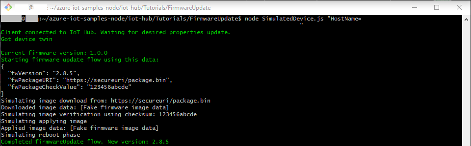

# Run a simple python sample on Ultra96v2 device running Ubuntu 18.04 PYNQ image.

---

# Table of Contents

- [Introduction](#Introduction)
- [Step 1: Prerequisites](#Prerequisites)
- [Step 2: Prepare your Device](#PrepareDevice)
- [Step 3: Manual Test for Azure IoT Edge on device](#Manual)
- [Step 4: Next Steps](#NextSteps)
- [Step 5: Troubleshooting](#Step-5-Troubleshooting)

# Instructions for using this template

- Replace the text in {placeholders} with correct values.
- Delete the lines {{enclosed}} after following the instructions enclosed between them.
- It is advisable to use external links, wherever possible.
- Remove this section from final document.

# Introduction

**About this document**

This document describes how to connect Ultra96v2 device running Ubuntu 18.04 PYNQ image with Azure IoT Edge Runtime pre-installed and Device Management. This multi-step process includes:

- Configuring Azure IoT Hub
- Registering your IoT device
- Build and Deploy client component to test device management capability

# Step 1: Prerequisites

You should have the following items ready before beginning the process:

- [Prepare your development environment][setup-devbox-linux]
- [Setup your IoT hub](https://account.windowsazure.com/signup?offer=ms-azr-0044p)
- [Provision your device and get its credentials](https://github.com/Azure/azure-iot-device-ecosystem/blob/master/manage_iot_hub.md)
- [Sign up to IOT Hub](https://account.windowsazure.com/signup?offer=ms-azr-0044p)
- [Add the Edge Device](https://docs.microsoft.com/en-us/azure/iot-edge/quickstart-linux)
- [Add the Edge Modules](https://docs.microsoft.com/en-us/azure/iot-edge/quickstart-linux#deploy-a-module)
- Ultra96v2 device.
- (optional) Vivado 2019.1 for FPGA customizations

# Step 2: Prepare your Device

- Go to Github project https://github.com/MakarenaLabs/Azure-IoT-Hub-PYNQ
- Follow the instruction on the chapter "Getting Started"

# Step 3: Manual Test for Azure IoT Edge on device

This section walks you through the test to be performed on the Edge devices running the Linux operating system such that it can qualify for Azure IoT Edge certification.

## 3.1 Edge RuntimeEnabled (Mandatory)

**Details of the requirement:**

The following components come pre-installed or at the point of distribution on the device to customer(s):

- Azure IoT Edge Security Daemon
- Daemon configuration file
- Moby container management system
- A version of `hsmlib`

_Edge Runtime Enabled:_

**Check the iotedge daemon command:**

Open the command prompt on your IoT Edge device , confirm that the Azure IoT edge Daemon is under running state

    systemctl status iotedge

Open the command prompt on your IoT Edge device, confirm that the module deployed from the cloud is running on your IoT Edge device

    sudo iotedge list

On the device details page of the Azure, you should see the runtime modules - edgeAgent and edgeHub modules are under running status

## 3.2 Device Management (Optional)

**Pre-requisites:** Device Connectivity.

**Description:** A device that can perform basic device management operations (Reboot and Firmware update) triggered by messages from IoT Hub.

## 3.2.1 Firmware Update and Reboot (Using Microsoft SDK Samples):

For these examples download this repository https://github.com/Azure-Samples/azure-iot-samples-node and open it.

To run the simulated device application, open a shell or command prompt window and navigate to the **iot-hub/Tutorials/FirmwareUpdate** folder in the Node.js project you downloaded. Then run the following commands:

    npm install
    node SimulatedDevice.js "{your device connection string}"

Your device string is in Azure Dashboard - {IoT Hub Name} - IoT devices - {Your device} and use the "Primary Connection String"

To run the back-end application, open another shell or command prompt window. Then navigate to the **iot-hub/Tutorials/FirmwareUpdate** folder in the Node.js project you downloaded. Then run the following commands:

    npm install
    node ServiceClient.js "{your service connection string}"

In order to get your service connection string open Azure shell and lauch this commands:

    hubname={The IoT Hub name setted in Azure}

    az iot hub show-connection-string --name $hubname --policy-name service -o table

The last command will return a string that is your service connection string.

IoT simulated service will send the message forcing a fake firmware update.

IoT device client will get the message and report the status to the device twin.

